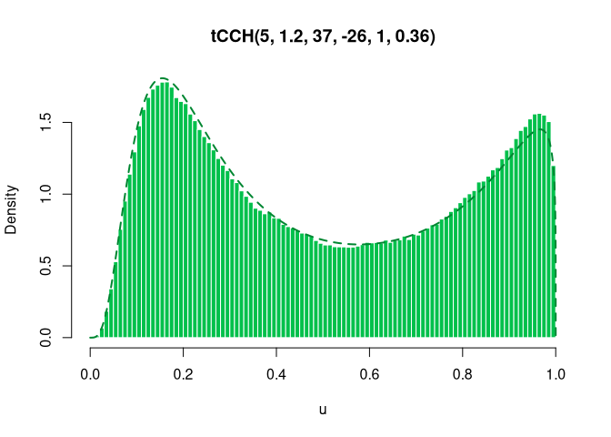

<!-- README.md is generated from README.Rmd. Please edit that file -->

# gambms

<!-- badges: start -->
<!-- badges: end -->

The goal of the package `gambms` is to provide RCpp implementations of
estimation methods for generalized additive models based on Bayesian
model selection with mixtures of g-priors.

## Installation

You can install the development version of gambms from
[GitHub](https://github.com/) with:

``` r
# install.packages("devtools")
devtools::install_github("hun-learning94/gambms")
```

You need to install the latest version of
[Rtools](https://cran.r-project.org/bin/windows/Rtools/) compatible with
your [R](https://cran.r-project.org/bin/windows/). For Windows users,
depending on your version of gcc compiler, you may encounter the
following error:

    #> error: 'mutex' in namespace 'std' does not name a type

If so, I would recommend installing a version of gcc compiler supporting
`posix` threads and `seh` exception handling, e.g.,
[`x86_64-posix-seh`](https://sourceforge.net/projects/mingw-w64/files/)
for Windows 10 or 11 64bit OS. Click
[here](https://stackoverflow.com/questions/17242516/mingw-w64-threads-posix-vs-win32)
and
[here](http://jaryl-lan.blogspot.com/2020/09/how-to-solve-mutex-in-namespace-std.html)
for more details.

## Examples

We illustrate the use case of `gambms` for a simulated dataset and a
real data. For more details, please see the paper in `docs` folder.

### Simulated data (Poisson, FREE-knot)

``` r
library(gambms)
set.seed(1)
f_list = list(f1 = function(x) 0.5 * (2*x^5 + 3*x^2 + cos(3*pi*x) - 1),
              f2 = function(x) 0.75*(0.0035 * (x*3 + 1.5)^3 + (x > -0.5 & x < 0.85) * 
                                       0.07 *sin(1.7*pi*(x*3 + 1.5)^2 / 3.2)*
                                       (x*3 -2.5)^2 * exp(x*3 + 1.5)),
              f3 = function(x) x,
              f4 = function(x) x*0)
n = 200
dat = simmat(f_list, -1, 1, n = n, family = "poisson")

mf = y~ncs(x1, nk = 20)+ 
  ncs(x2, nk = 20)  + 
  ncs(x3, nk = 20) + 
  ncs(x4, nk = 20)

fit_sim = tryCatch(
  gambms(mf, dat,
         knotConfig = "FREE",
         prior = "Intrinsic",
         family = "poisson"),
  error = function(cnd)cnd
)

plot(fit_sim)
```


### Pima Indian Diabetes (Bernoulli, VS-knot)

``` r
data("Pima")
mf = diabetes ~
  ncs(pregnant, nk = 20) +
  ncs(glucose, nk = 20) +
  ncs(pressure, nk = 20) +
  ncs(triceps, nk = 20) +
  ncs(mass, nk = 20) +
  ncs(pedigree, nk = 20) +
  ncs(age, nk = 20)
fit_Pima =  gambms(mf, Pima,
                   knotConfig = "VS",
                   prior = "Intrinsic",
                   family = "bernoulli",
                   Ctrl = list(mcmcIter = 2000))
summary(fit_Pima)
plot(fit_Pima)
plotnumknot(fit_Pima)
plotresiduals(fit_Pima)
```

    #> fm: 
    #> diabetes ~ ncs(pregnant, nk = 20) + ncs(glucose, nk = 20) + ncs(pressure, 
    #>     nk = 20) + ncs(triceps, nk = 20) + ncs(mass, nk = 20) + ncs(pedigree, 
    #>     nk = 20) + ncs(age, nk = 20)
    #> 
    #> Family:                                           binomial 
    #> Link function:                                    logit 
    #> g-prior:                                          Intrinsic 
    #> ------------------------------------------------------------ 
    #> Sample size:                                      532 
    #> Number of smooth covariates:                      7 
    #> Number of linear terms (including intercept):     1 
    #> Knot configuration:                               VS 
    #> Maximum number of knots:                          11 20 18 20 20 20 17 
    #> Prior mean on number of knots:                    0.2 0.2 0.2 0.2 0.2 0.2 0.2 
    #> ------------------------------------------------------------- 
    #> Marginal probability that sm is linear: 
    #> pregnant  glucose pressure  triceps     mass pedigree      age 
    #>    0.900    0.980    0.980    0.970    0.700    0.930    0.066 
    #> ------------------------------------------------------------- 
    #> Linear coefficients:
    #>                mean  median      sd z_score lower95 upper95
    #> (Intercept) -1.0794 -1.0750  0.1440 -7.4943 -1.3721 -0.8054
    #> ------------------------------------------------------------ 
    #> Sampled g values:
    #>       mean   median       sd  lower95  upper95
    #> g  62.2392  59.7952  16.2000  41.1786 104.7524
    #> -------------------------------------------------------------


## Bonus: sampling from tCCH distribution

The truncated Compound Confluent Hypergeometric (tCCH) distribution is a
variant of generalized beta distribution tuned with a total of $5$
parameters. We provide a straightforward sampling algorithm based on
slice sampling, essentially Gibbs, for this and other variants including
Gaussian Hypergeometric, Confluent Hypergeometric, and Appell
Hypergeometric distribution. Read the paper in `docs` for more details.

``` r
a=5; b=1.2; z=37; s=-26; nu = 1; theta = 0.36
u = seq(0, 1/nu, len=1e4)
samp = rtCCH(1e6, a, b, z, s, nu, theta)
hist(samp, nclass=100, probability = T,
     xlab= "u", ylab = "Density", col="#00c04b", border="white",
     main = paste0("tCCH(", a,", ", b,", ", z,", ", s,", ", nu,", ", theta, ")"))
lines(u, dtCCH(u, a, b, z, s, nu, theta), col="#008631", lwd=2, lty=2)
```



## System environment

I built the package and conducted the simulations under the following
environment:

``` r
sessioninfo::session_info()
#> - Session info ---------------------------------------------------------------
#>  setting  value
#>  version  R version 4.1.2 (2021-11-01)
#>  os       Windows 10 x64 (build 22631)
#>  system   x86_64, mingw32
#>  ui       RTerm
#>  language (EN)
#>  collate  English_United States.1252
#>  ctype    English_United States.1252
#>  tz       Asia/Seoul
#>  date     2024-08-18
#>  pandoc   3.1.11 @ C:/Program Files/RStudio/resources/app/bin/quarto/bin/tools/ (via rmarkdown)
#> 
#> - Packages -------------------------------------------------------------------
#>  package     * version    date (UTC) lib source
#>  cli           3.6.2      2023-12-11 [2] CRAN (R 4.1.2)
#>  digest        0.6.35     2024-03-11 [2] CRAN (R 4.1.2)
#>  evaluate      0.24.0     2024-06-10 [2] CRAN (R 4.1.2)
#>  fastmap       1.2.0      2024-05-15 [2] CRAN (R 4.1.2)
#>  gambms      * 0.0.0.9000 2024-08-18 [1] local
#>  highr         0.11       2024-05-26 [2] CRAN (R 4.1.2)
#>  htmltools     0.5.8.1    2024-04-04 [2] CRAN (R 4.1.2)
#>  knitr         1.47       2024-05-29 [2] CRAN (R 4.1.2)
#>  Rcpp          1.0.12     2024-01-09 [2] CRAN (R 4.1.2)
#>  rlang         1.1.4      2024-06-04 [2] CRAN (R 4.1.2)
#>  rmarkdown     2.27       2024-05-17 [2] CRAN (R 4.1.2)
#>  rstudioapi    0.16.0     2024-03-24 [2] CRAN (R 4.1.2)
#>  sessioninfo   1.2.2      2021-12-06 [2] CRAN (R 4.1.3)
#>  xfun          0.44       2024-05-15 [2] CRAN (R 4.1.2)
#>  yaml          2.3.8      2023-12-11 [2] CRAN (R 4.1.2)
#> 
#>  [1] C:/Users/hunlearning/AppData/Local/Temp/RtmpiOKgYf/temp_libpath62d827772698
#>  [2] C:/Users/hunlearning/Documents/R/win-library/4.1
#>  [3] C:/Program Files/R/R-4.1.2/library
#> 
#> ------------------------------------------------------------------------------
```

``` r
system("gcc -v")
#> Using built-in specs.
#> COLLECT_GCC=C:\PROGRA~1\mingw64\bin\gcc.exe
#> COLLECT_LTO_WRAPPER=C:/PROGRA~1/mingw64/bin/../libexec/gcc/x86_64-w64-mingw32/8.1.0/lto-wrapper.exe
#> Target: x86_64-w64-mingw32
#> Configured with: ../../../src/gcc-8.1.0/configure --host=x86_64-w64-mingw32 --build=x86_64-w64-mingw32 --target=x86_64-w64-mingw32 --prefix=/mingw64 --with-sysroot=/c/mingw810/x86_64-810-posix-seh-rt_v6-rev0/mingw64 --enable-shared --enable-static --disable-multilib --enable-languages=c,c++,fortran,lto --enable-libstdcxx-time=yes --enable-threads=posix --enable-libgomp --enable-libatomic --enable-lto --enable-graphite --enable-checking=release --enable-fully-dynamic-string --enable-version-specific-runtime-libs --disable-libstdcxx-pch --disable-libstdcxx-debug --enable-bootstrap --disable-rpath --disable-win32-registry --disable-nls --disable-werror --disable-symvers --with-gnu-as --with-gnu-ld --with-arch=nocona --with-tune=core2 --with-libiconv --with-system-zlib --with-gmp=/c/mingw810/prerequisites/x86_64-w64-mingw32-static --with-mpfr=/c/mingw810/prerequisites/x86_64-w64-mingw32-static --with-mpc=/c/mingw810/prerequisites/x86_64-w64-mingw32-static --with-isl=/c/mingw810/prerequisites/x86_64-w64-mingw32-static --with-pkgversion='x86_64-posix-seh-rev0, Built by MinGW-W64 project' --with-bugurl=https://sourceforge.net/projects/mingw-w64 CFLAGS='-O2 -pipe -fno-ident -I/c/mingw810/x86_64-810-posix-seh-rt_v6-rev0/mingw64/opt/include -I/c/mingw810/prerequisites/x86_64-zlib-static/include -I/c/mingw810/prerequisites/x86_64-w64-mingw32-static/include' CXXFLAGS='-O2 -pipe -fno-ident -I/c/mingw810/x86_64-810-posix-seh-rt_v6-rev0/mingw64/opt/include -I/c/mingw810/prerequisites/x86_64-zlib-static/include -I/c/mingw810/prerequisites/x86_64-w64-mingw32-static/include' CPPFLAGS=' -I/c/mingw810/x86_64-810-posix-seh-rt_v6-rev0/mingw64/opt/include -I/c/mingw810/prerequisites/x86_64-zlib-static/include -I/c/mingw810/prerequisites/x86_64-w64-mingw32-static/include' LDFLAGS='-pipe -fno-ident -L/c/mingw810/x86_64-810-posix-seh-rt_v6-rev0/mingw64/opt/lib -L/c/mingw810/prerequisites/x86_64-zlib-static/lib -L/c/mingw810/prerequisites/x86_64-w64-mingw32-static/lib '
#> Thread model: posix
#> gcc version 8.1.0 (x86_64-posix-seh-rev0, Built by MinGW-W64 project) 
```

<!-- What is special about using `README.Rmd` instead of just `README.md`? You can include R chunks like so: -->
<!-- ```{r cars} -->
<!-- summary(cars) -->
<!-- ``` -->
<!-- You'll still need to render `README.Rmd` regularly, to keep `README.md` up-to-date. `devtools::build_readme()` is handy for this. You could also use GitHub Actions to re-render `README.Rmd` every time you push. An example workflow can be found here: <https://github.com/r-lib/actions/tree/v1/examples>. -->
<!-- You can also embed plots, for example: -->
<!-- ```{r pressure, echo = FALSE} -->
<!-- plot(pressure) -->
<!-- ``` -->
<!-- In that case, don't forget to commit and push the resulting figure files, so they display on GitHub and CRAN. -->
