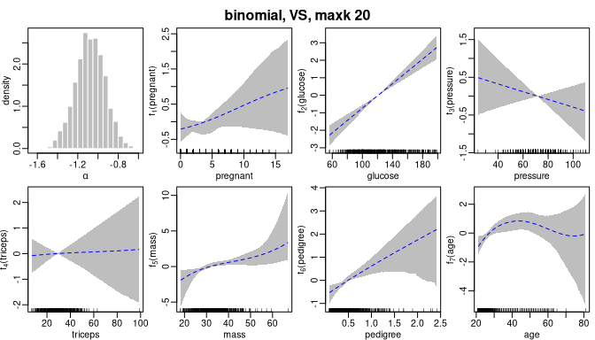

<!-- README.md is generated from README.Rmd. Please edit that file -->

# gambms

<!-- badges: start -->
<!-- badges: end -->

The goal of the package `gambms` is to provide RCpp implementations of
estimation methods for generalized additive models based on Bayesian
model selection with mixtures of g-priors.

## Installation

You can install the development version of gambms from
[GitHub](https://github.com/) with:

``` r
# install.packages("devtools")
devtools::install_github("hun-learning94/gambms")
```

You need to install the latest version of
[Rtools](https://cran.r-project.org/bin/windows/Rtools/) compatible with
your [R](https://cran.r-project.org/bin/windows/). For Windows users,
depending on your version of gcc compiler, you may encounter the
following error:

    #> error: 'mutex' in namespace 'std' does not name a type

If so, I would recommend installing a version of gcc compiler supporting
`posix` threads and `seh` exception handling, e.g.,
[`x86_64-posix-seh`](https://sourceforge.net/projects/mingw-w64/files/)
for Windows 10 or 11 64bit OS. Click
[here](https://stackoverflow.com/questions/17242516/mingw-w64-threads-posix-vs-win32)
and
[here](http://jaryl-lan.blogspot.com/2020/09/how-to-solve-mutex-in-namespace-std.html)
for more details.

## Examples

We illustrate the use case of `gambms` for a simulated dataset and a
real data. For more details, please see the paper in `docs` folder.

### Simulated data (Poisson, FREE-knot)

``` r
library(gambms)
set.seed(2021311165)
f_list = list(f1 = function(x) 0.5 * (2*x^5 + 3*x^2 + cos(3*pi*x) - 1),
              f2 = function(x) x,
              f3 = function(x) 0.75*(0.0035 * (x*3 + 1.5)^3 + (x > -0.5 & x < 0.85) *
                                       0.07 *sin(1.7*pi*(x*3 + 1.5)^2 / 3.2)*(x*3 -2.5)^2 * exp(x*3 + 1.5)))
n = 300
dat = simmat(f_list, -1, 1, n = n, family = "poisson")
maxk = 20
mf = y~ncs(x1, nk=maxk)+ ncs(x2, nk = maxk)  + ncs(x3, nk = maxk)
fit_sim = tryCatch(
  gambms(mf, dat,
         knotConfig = "FREE",
         prior = "Robust",
         family = "poisson",
         printIter=500,
         freeCtrl=list(mcmcIter = 4000, thin = maxk)),
  error = function(cnd)cnd
)
plot(fit_sim)
```


### Real data 1) Boston Housing Prices (Gaussian, VS-knot)

``` r
data("Boston")
maxk=15; lambda = 1
mf = log(medv) ~ chas +
  ncs(crim, nk = maxk, lambda=lambda) +
  ncs(zn, nk = maxk, lambda=lambda) +
  ncs(indus, nk = maxk, lambda=lambda) +
  ncs(nox, nk = maxk, lambda=lambda) +
  ncs(rm, nk = maxk, lambda=lambda) +
  ncs(age, nk = maxk, lambda=lambda) +
  ncs(dis, nk = maxk, lambda=lambda) +
  ncs(rad, nk = maxk, lambda=lambda) +
  ncs(tax, nk = maxk, lambda=lambda) +
  ncs(ptratio, nk = maxk, lambda=lambda) +
  ncs(black, nk = maxk, lambda=lambda) +
  ncs(lstat, nk = maxk, lambda=lambda)
fit =  gambms(mf, Boston,
                 knotConfig = "VS",
                 prior = "Robust",
                 family = "gaussian")
summary(fit)
plot(fit)
plotnumknot(fit)
plotresiduals(fit)
```

    #> fm: 
    #> log(medv) ~ chas + ncs(crim, nk = maxk, lambda = lambda) + ncs(zn, 
    #>     nk = maxk, lambda = lambda) + ncs(indus, nk = maxk, lambda = lambda) + 
    #>     ncs(nox, nk = maxk, lambda = lambda) + ncs(rm, nk = maxk, 
    #>     lambda = lambda) + ncs(age, nk = maxk, lambda = lambda) + 
    #>     ncs(dis, nk = maxk, lambda = lambda) + ncs(rad, nk = maxk, 
    #>     lambda = lambda) + ncs(tax, nk = maxk, lambda = lambda) + 
    #>     ncs(ptratio, nk = maxk, lambda = lambda) + ncs(black, nk = maxk, 
    #>     lambda = lambda) + ncs(lstat, nk = maxk, lambda = lambda)
    #> 
    #> Family:                                           gaussian 
    #> Link function:                                    identity 
    #> g-prior:                                          Robust 
    #> ------------------------------------------------------------ 
    #> Sample size:                                      506 
    #> Number of smooth covariates:                      12 
    #> Number of linear terms (including intercept):     2 
    #> Knot configuration:                               VS 
    #> Maximum number of knots:                          15 15 15 15 15 15 15 8 15 15 15 15 
    #> Prior mean on number of knots:                    1 1 1 1 1 1 1 1 1 1 1 1 
    #> ------------------------------------------------------------- 
    #> Marginal probability that sm is linear: 
    #>    crim      zn   indus     nox      rm     age     dis     rad     tax ptratio 
    #>  0.0015  0.8600  0.8000  0.0000  0.0000  0.9000  0.0000  0.7800  0.6100  0.7300 
    #>   black   lstat 
    #>  0.7400  0.1500 
    #> ------------------------------------------------------------- 
    #> Linear coefficients:
    #>                 mean   median       sd  z_score  lower95  upper95
    #> (Intercept)   3.0363   3.0362   0.0065 464.3725   3.0234   3.0493
    #> chas          0.0301   0.0295   0.0286   1.0521  -0.0260   0.0860
    #> ------------------------------------------------------------ 
    #> Sampled g values:
    #>       mean   median       sd  lower95  upper95
    #> g 334.3914 297.4666 155.6324 154.4896 756.6889
    #> ------------------------------------------------------------- 
    #> Sampled sigma values:
    #>       mean median     sd lower95 upper95
    #> sig 0.1419 0.1417 0.0049  0.1326  0.1521
    #> -------------------------------------------------------------




### Real data 2) Pima Indian Diabetes (Bernoulli, EVEN-knot)

``` r
data("Pima")
maxk=15; lambda = 1
mf = diabetes ~
  ncs(pregnant, nk = maxk, lambda = lambda) +
  ncs(glucose, nk = maxk, lambda = lambda) +
  ncs(pressure, nk = maxk, lambda = lambda) +
  ncs(triceps, nk = maxk, lambda = lambda) +
  ncs(mass, nk = maxk, lambda = lambda) +
  ncs(pedigree, nk = maxk, lambda = lambda) +
  ncs(age, nk = maxk, lambda = lambda)
fit =  gambms(mf, Pima,
              knotConfig = "EVEN",
              prior = "Robust",
              family = "bernoulli",
              printIter = 500)

summary(fit)
plot(fit)
plotnumknot(fit)
plotresiduals(fit)
```

    #> fm: 
    #> diabetes ~ ncs(pregnant, nk = maxk, lambda = lambda) + ncs(glucose, 
    #>     nk = maxk, lambda = lambda) + ncs(pressure, nk = maxk, lambda = lambda) + 
    #>     ncs(triceps, nk = maxk, lambda = lambda) + ncs(mass, nk = maxk, 
    #>     lambda = lambda) + ncs(pedigree, nk = maxk, lambda = lambda) + 
    #>     ncs(age, nk = maxk, lambda = lambda)
    #> 
    #> Family:                                           binomial 
    #> Link function:                                    logit 
    #> g-prior:                                          Robust 
    #> ------------------------------------------------------------ 
    #> Sample size:                                      532 
    #> Number of smooth covariates:                      7 
    #> Number of linear terms (including intercept):     1 
    #> Knot configuration:                               EVEN 
    #> Maximum number of knots:                          15 15 15 15 15 15 15 
    #> Prior mean on number of knots:                    1 1 1 1 1 1 1 
    #> ------------------------------------------------------------- 
    #> Marginal probability that sm is linear: 
    #> pregnant  glucose pressure  triceps     mass pedigree      age 
    #>   0.2100   0.7300   0.7200   0.6900   0.0430   0.6800   0.0075 
    #> ------------------------------------------------------------- 
    #> Linear coefficients:
    #>                mean  median      sd z_score lower95 upper95
    #> (Intercept) -1.1698 -1.1719  0.1235 -9.4689 -1.4064 -0.9265
    #> ------------------------------------------------------------ 
    #> Sampled g values:
    #>        mean    median        sd   lower95   upper95
    #> g 1715.3347 1405.5127 1092.6665  598.5150 4607.4314
    #> -------------------------------------------------------------


## Bonus: sampling from tCCH distribution

The truncated Compound Confluent Hypergeometric (tCCH) distribution is a
variant of generalized beta distribution tuned with a total of $5$
parameters. We provide a straightforward sampling algorithm based on
slice sampling, essentially Gibbs, for this and other variants including
Gaussian Hypergeometric, Confluent Hypergeometric, and Appell
Hypergeometric distribution. Read the paper in `docs` for more details.

``` r
a=12; b=0.4; z=25; s=-10; nu = 1.1; theta = 0.14
u = seq(0, 1/nu, len=1e4)
samp = rtCCH(1e6, a, b, z, s, nu, theta)
hist(samp, nclass=100, probability = T,
     xlab= "u", ylab = "Density", col="#00c04b", border="white",
     main = paste0("tCCH(", a,", ", b,", ", z,", ", s,", ", nu,", ", theta, ")"))
lines(u, dtCCH(u, a, b, z, s, nu, theta), col="#008631", lwd=2, lty=2)
```


FYI, I built the package and conducted the simulations under the
following environment:

``` r
sessionInfo()
#> R version 4.2.2 (2022-10-31 ucrt)
#> Platform: x86_64-w64-mingw32/x64 (64-bit)
#> Running under: Windows 10 x64 (build 22621)
#> 
#> Matrix products: default
#> 
#> locale:
#> [1] LC_COLLATE=English_United States.utf8 
#> [2] LC_CTYPE=English_United States.utf8   
#> [3] LC_MONETARY=English_United States.utf8
#> [4] LC_NUMERIC=C                          
#> [5] LC_TIME=English_United States.utf8    
#> 
#> attached base packages:
#> [1] stats     graphics  grDevices utils     datasets  methods   base     
#> 
#> other attached packages:
#> [1] gambms_0.0.0.9000
#> 
#> loaded via a namespace (and not attached):
#>  [1] Rcpp_1.0.9      digest_0.6.31   lifecycle_1.0.3 magrittr_2.0.3 
#>  [5] evaluate_0.19   highr_0.10      rlang_1.0.6     stringi_1.7.8  
#>  [9] cli_3.5.0       rstudioapi_0.14 vctrs_0.5.1     rmarkdown_2.19 
#> [13] tools_4.2.2     stringr_1.5.0   glue_1.6.2      xfun_0.36      
#> [17] yaml_2.3.6      fastmap_1.1.0   compiler_4.2.2  htmltools_0.5.4
#> [21] knitr_1.41
```

<!-- What is special about using `README.Rmd` instead of just `README.md`? You can include R chunks like so: -->
<!-- ```{r cars} -->
<!-- summary(cars) -->
<!-- ``` -->
<!-- You'll still need to render `README.Rmd` regularly, to keep `README.md` up-to-date. `devtools::build_readme()` is handy for this. You could also use GitHub Actions to re-render `README.Rmd` every time you push. An example workflow can be found here: <https://github.com/r-lib/actions/tree/v1/examples>. -->
<!-- You can also embed plots, for example: -->
<!-- ```{r pressure, echo = FALSE} -->
<!-- plot(pressure) -->
<!-- ``` -->
<!-- In that case, don't forget to commit and push the resulting figure files, so they display on GitHub and CRAN. -->
