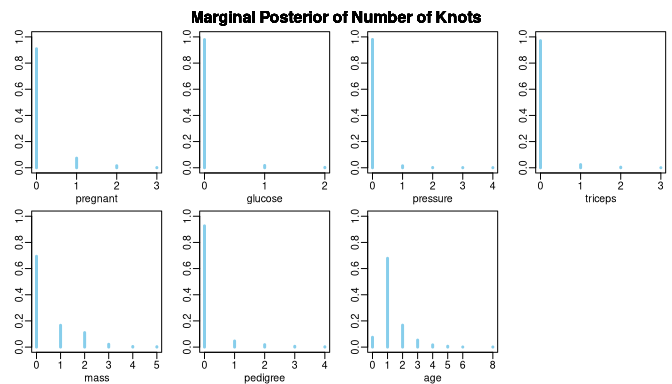

<!-- README.md is generated from README.Rmd. Please edit that file -->

# gambms

<!-- badges: start -->
<!-- badges: end -->

The goal of the package `gambms` is to provide RCpp implementations of
estimation methods for generalized additive models based on Bayesian
model selection with mixtures of g-priors.

## Installation

You can install the development version of gambms from
[GitHub](https://github.com/) with:

``` r
# install.packages("devtools")
devtools::install_github("hun-learning94/gambms")
```

You need to install the latest version of
[Rtools](https://cran.r-project.org/bin/windows/Rtools/) compatible with
your [R](https://cran.r-project.org/bin/windows/). For Windows users,
depending on your version of gcc compiler, you may encounter the
following error:

    #> error: 'mutex' in namespace 'std' does not name a type

If so, I would recommend installing a version of gcc compiler supporting
`posix` threads and `seh` exception handling, e.g.,
[`x86_64-posix-seh`](https://sourceforge.net/projects/mingw-w64/files/)
for Windows 10 or 11 64bit OS. Click
[here](https://stackoverflow.com/questions/17242516/mingw-w64-threads-posix-vs-win32)
and
[here](http://jaryl-lan.blogspot.com/2020/09/how-to-solve-mutex-in-namespace-std.html)
for more details.

## Examples

We illustrate the use case of `gambms` for a simulated dataset and a
real data. For more details, please see the paper in `docs` folder.

### Simulated data (Poisson, FREE-knot)

``` r
library(gambms)
set.seed(1)
f_list = list(f1 = function(x) 0.5 * (2*x^5 + 3*x^2 + cos(3*pi*x) - 1),
              f2 = function(x) 0.75*(0.0035 * (x*3 + 1.5)^3 + (x > -0.5 & x < 0.85) * 
                                       0.07 *sin(1.7*pi*(x*3 + 1.5)^2 / 3.2)*
                                       (x*3 -2.5)^2 * exp(x*3 + 1.5)),
              f3 = function(x) x,
              f4 = function(x) x*0)
n = 200
dat = simmat(f_list, -1, 1, n = n, family = "poisson")

mf = y~ncs(x1, nk = 20)+ 
  ncs(x2, nk = 20)  + 
  ncs(x3, nk = 20) + 
  ncs(x4, nk = 20)

fit_sim = tryCatch(
  gambms(mf, dat,
         knotConfig = "FREE",
         prior = "Intrinsic",
         family = "poisson"),
  error = function(cnd)cnd
)

plot(fit_sim)
```


### Pima Indian Diabetes (Bernoulli, VS-knot)

``` r
data("Pima")
mf = diabetes ~
  ncs(pregnant, nk = 20) +
  ncs(glucose, nk = 20) +
  ncs(pressure, nk = 20) +
  ncs(triceps, nk = 20) +
  ncs(mass, nk = 20) +
  ncs(pedigree, nk = 20) +
  ncs(age, nk = 20)
fit_Pima =  gambms(mf, Pima,
                   knotConfig = "VS",
                   prior = "Intrinsic",
                   family = "bernoulli",
                   Ctrl = list(mcmcIter = 2000))
summary(fit_Pima)
plot(fit_Pima)
plotnumknot(fit_Pima)
plotresiduals(fit_Pima)
```

    #> fm: 
    #> diabetes ~ ncs(pregnant, nk = 20) + ncs(glucose, nk = 20) + ncs(pressure, 
    #>     nk = 20) + ncs(triceps, nk = 20) + ncs(mass, nk = 20) + ncs(pedigree, 
    #>     nk = 20) + ncs(age, nk = 20)
    #> 
    #> Family:                                           binomial 
    #> Link function:                                    logit 
    #> g-prior:                                          Intrinsic 
    #> ------------------------------------------------------------ 
    #> Sample size:                                      532 
    #> Number of smooth covariates:                      7 
    #> Number of linear terms (including intercept):     1 
    #> Knot configuration:                               VS 
    #> Maximum number of knots:                          11 20 18 20 20 20 17 
    #> Prior mean on number of knots:                    0.2 0.2 0.2 0.2 0.2 0.2 0.2 
    #> ------------------------------------------------------------- 
    #> Marginal probability that sm is linear: 
    #> pregnant  glucose pressure  triceps     mass pedigree      age 
    #>    0.910    0.980    0.980    0.970    0.690    0.930    0.075 
    #> ------------------------------------------------------------- 
    #> Linear coefficients:
    #>                mean  median      sd z_score lower95 upper95
    #> (Intercept) -1.0770 -1.0748  0.1452 -7.4184 -1.3726 -0.7993
    #> ------------------------------------------------------------ 
    #> Sampled g values:
    #>       mean   median       sd  lower95  upper95
    #> g  62.4084  59.8361  16.9437  40.9775 104.7476
    #> -------------------------------------------------------------




## System environment

I built the package and executed the above examples under the following
environment:

``` r
sessioninfo::session_info()
#> ─ Session info ───────────────────────────────────────────────────────────────
#>  setting  value
#>  version  R version 4.3.3 (2024-02-29)
#>  os       Fedora Linux 39 (Server Edition)
#>  system   x86_64, linux-gnu
#>  ui       X11
#>  language (EN)
#>  collate  en_US.UTF-8
#>  ctype    en_US.UTF-8
#>  tz       America/New_York
#>  date     2024-08-18
#>  pandoc   3.1.11 @ /usr/lib/rstudio-server/bin/quarto/bin/tools/x86_64/ (via rmarkdown)
#> 
#> ─ Packages ───────────────────────────────────────────────────────────────────
#>  package     * version    date (UTC) lib source
#>  cli           3.6.3      2024-06-21 [4] CRAN (R 4.3.3)
#>  digest        0.6.36     2024-06-23 [4] CRAN (R 4.3.3)
#>  evaluate      0.24.0     2024-06-10 [4] CRAN (R 4.3.3)
#>  fastmap       1.2.0      2024-05-15 [4] CRAN (R 4.3.3)
#>  gambms      * 0.0.0.9000 2024-08-18 [1] local
#>  highr         0.11       2024-05-26 [4] CRAN (R 4.3.3)
#>  htmltools     0.5.8      2024-03-25 [3] CRAN (R 4.3.2)
#>  knitr         1.48       2024-07-07 [4] CRAN (R 4.3.3)
#>  Rcpp          1.0.13     2024-07-17 [3] CRAN (R 4.3.3)
#>  rlang         1.1.4      2024-06-04 [4] CRAN (R 4.3.3)
#>  rmarkdown     2.28       2024-08-17 [4] CRAN (R 4.3.3)
#>  rstudioapi    0.16.0     2024-03-24 [3] CRAN (R 4.3.2)
#>  sessioninfo   1.2.2      2021-12-06 [4] CRAN (R 4.3.1)
#>  xfun          0.47       2024-08-17 [2] CRAN (R 4.3.3)
#>  yaml          2.3.10     2024-07-26 [4] CRAN (R 4.3.3)
#> 
#>  [1] /tmp/RtmptxjdeZ/temp_libpath2990594b194918
#>  [2] /home/g/gk149/R/x86_64-redhat-linux-gnu-library/4.3
#>  [3] /usr/local/lib/R/library
#>  [4] /usr/lib64/R/library
#>  [5] /usr/share/R/library
#> 
#> ──────────────────────────────────────────────────────────────────────────────
```

``` r
system("gcc -v")
#>Using built-in specs.
#>COLLECT_GCC=gcc
#>COLLECT_LTO_WRAPPER=/usr/libexec/gcc/x86_64-redhat-linux/13/lto-wrapper
#>OFFLOAD_TARGET_NAMES=nvptx-none
#>OFFLOAD_TARGET_DEFAULT=1
#>Target: x86_64-redhat-linux
#>Configured with: ../configure --enable-bootstrap --enable-languages=c,c++,fortran,objc,obj-c++,ada,go,d,m2,lto --prefix=/usr --mandir=/usr/share/man --infodir=/usr/share/info --with-bugurl=http://bugzilla.redhat.com/bugzilla --enable-shared --enable-threads=posix --enable-checking=release --enable-multilib --with-system-zlib --enable-__cxa_atexit --disable-libunwind-exceptions --enable-gnu-unique-object --enable-linker-build-id --with-gcc-major-version-only --enable-libstdcxx-backtrace --with-libstdcxx-zoneinfo=/usr/share/zoneinfo --with-linker-hash-style=gnu --enable-plugin --enable-initfini-array --with-isl=/builddir/build/BUILD/gcc-13.3.1-20240522/obj-x86_64-redhat-linux/isl-install --enable-offload-targets=nvptx-none --without-cuda-driver --enable-offload-defaulted --enable-gnu-indirect-function --enable-cet --with-tune=generic --with-arch_32=i686 --build=x86_64-redhat-linux --with-build-config=bootstrap-lto --enable-link-serialization=1
#>Thread model: posix
#>Supported LTO compression algorithms: zlib zstd
#>gcc version 13.3.1 20240522 (Red Hat 13.3.1-1) (GCC)
```

<!-- What is special about using `README.Rmd` instead of just `README.md`? You can include R chunks like so: -->
<!-- ```{r cars} -->
<!-- summary(cars) -->
<!-- ``` -->
<!-- You'll still need to render `README.Rmd` regularly, to keep `README.md` up-to-date. `devtools::build_readme()` is handy for this. You could also use GitHub Actions to re-render `README.Rmd` every time you push. An example workflow can be found here: <https://github.com/r-lib/actions/tree/v1/examples>. -->
<!-- You can also embed plots, for example: -->
<!-- ```{r pressure, echo = FALSE} -->
<!-- plot(pressure) -->
<!-- ``` -->
<!-- In that case, don't forget to commit and push the resulting figure files, so they display on GitHub and CRAN. -->
