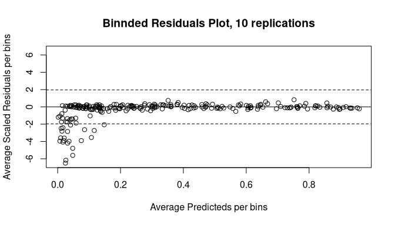

<!-- README.md is generated from README.Rmd. Please edit that file -->

# gambms

<!-- badges: start -->
<!-- badges: end -->

The goal of the package `gambms` is to provide RCpp implementations of
estimation methods for generalized additive models based on Bayesian
model selection with mixtures of g-priors.

## Installation

You can install the development version of gambms from
[GitHub](https://github.com/) with:

``` r
# install.packages("devtools")
devtools::install_github("hun-learning94/gambms")
```

You need to install the latest version of
[Rtools](https://cran.r-project.org/bin/windows/Rtools/) compatible with
your [R](https://cran.r-project.org/bin/windows/). For Windows users,
depending on your version of gcc compiler, you may encounter the
following error:

    #> error: 'mutex' in namespace 'std' does not name a type

If so, I would recommend installing a version of gcc compiler supporting
`posix` threads and `seh` exception handling, e.g.,
[`x86_64-posix-seh`](https://sourceforge.net/projects/mingw-w64/files/)
for Windows 10 or 11 64bit OS. Click
[here](https://stackoverflow.com/questions/17242516/mingw-w64-threads-posix-vs-win32)
and
[here](http://jaryl-lan.blogspot.com/2020/09/how-to-solve-mutex-in-namespace-std.html)
for more details.

## Examples

We illustrate the use case of `gambms` for a simulated dataset and a
real data. For more details, please see the paper in `docs` folder.

### Simulated data (Poisson, FREE-knot)

``` r
library(gambms)
set.seed(2021311165)
f_list = list(f1 = function(x) 0.5 * (2*x^5 + 3*x^2 + cos(3*pi*x) - 1),
              f2 = function(x) x,
              f3 = function(x) 0.75*(0.0035 * (x*3 + 1.5)^3 + (x > -0.5 & x < 0.85) *
                                       0.07 *sin(1.7*pi*(x*3 + 1.5)^2 / 3.2)*(x*3 -2.5)^2 * exp(x*3 + 1.5)))
n = 300
dat = simmat(f_list, -1, 1, n = n, family = "poisson")
maxk = 20
mf = y~ncs(x1, nk=maxk)+ ncs(x2, nk = maxk)  + ncs(x3, nk = maxk)
fit_sim = tryCatch(
  gambms(mf, dat,
         knotConfig = "FREE",
         prior = "Intrinsic",
         family = "poisson",
         printIter = 500),
  error = function(cnd)cnd
)
plot(fit_sim)
```


### Real data 1) Boston Housing Prices (Gaussian, EVEN-knot)

``` r
data("Boston")
maxk=15; lambda = .1
mf = log(medv) ~ chas +
  ncs(crim, nk = maxk, lambda=lambda) +
  ncs(zn, nk = maxk, lambda=lambda) +
  ncs(indus, nk = maxk, lambda=lambda) +
  ncs(nox, nk = maxk, lambda=lambda) +
  ncs(rm, nk = maxk, lambda=lambda) +
  ncs(age, nk = maxk, lambda=lambda) +
  ncs(dis, nk = maxk, lambda=lambda) +
  ncs(rad, nk = maxk, lambda=lambda) +
  ncs(tax, nk = maxk, lambda=lambda) +
  ncs(ptratio, nk = maxk, lambda=lambda) +
  ncs(black, nk = maxk, lambda=lambda) +
  ncs(lstat, nk = maxk, lambda=lambda)
fit =  gambms(mf, Boston,
                 knotConfig = "EVEN",
                 prior = "Intrinsic",
                 family = "gaussian")
summary(fit)
plot(fit)
plotnumknot(fit)
plotresiduals(fit)
```

    #> fm: 
    #> log(medv) ~ chas + ncs(crim, nk = maxk, lambda = lambda) + ncs(zn, 
    #>     nk = maxk, lambda = lambda) + ncs(indus, nk = maxk, lambda = lambda) + 
    #>     ncs(nox, nk = maxk, lambda = lambda) + ncs(rm, nk = maxk, 
    #>     lambda = lambda) + ncs(age, nk = maxk, lambda = lambda) + 
    #>     ncs(dis, nk = maxk, lambda = lambda) + ncs(rad, nk = maxk, 
    #>     lambda = lambda) + ncs(tax, nk = maxk, lambda = lambda) + 
    #>     ncs(ptratio, nk = maxk, lambda = lambda) + ncs(black, nk = maxk, 
    #>     lambda = lambda) + ncs(lstat, nk = maxk, lambda = lambda)
    #> 
    #> Family:                                           gaussian 
    #> Link function:                                    identity 
    #> g-prior:                                          Intrinsic 
    #> ------------------------------------------------------------ 
    #> Sample size:                                      506 
    #> Number of smooth covariates:                      12 
    #> Number of linear terms (including intercept):     2 
    #> Knot configuration:                               EVEN 
    #> Maximum number of knots:                          15 15 15 15 15 15 15 15 15 15 15 15 
    #> Prior mean on number of knots:                    0.1 0.1 0.1 0.1 0.1 0.1 0.1 0.1 0.1 0.1 0.1 0.1 
    #> ------------------------------------------------------------- 
    #> Marginal probability that sm is linear: 
    #>    crim      zn   indus     nox      rm     age     dis     rad     tax ptratio 
    #>  0.0048  0.8600  0.2300  0.0040  0.0000  0.8500  0.0140  0.5500  0.2400  0.7900 
    #>   black   lstat 
    #>  0.5600  0.1400 
    #> ------------------------------------------------------------- 
    #> Linear coefficients:
    #>                 mean   median       sd  z_score  lower95  upper95
    #> (Intercept)   3.0365   3.0363   0.0064 472.5580   3.0244   3.0491
    #> chas          0.0299   0.0302   0.0288   1.0406  -0.0260   0.0866
    #> ------------------------------------------------------------ 
    #> Sampled g values:
    #>       mean   median       sd  lower95  upper95
    #> g  85.0739  82.5075  21.1571  53.4013 136.3808
    #> ------------------------------------------------------------- 
    #> Sampled sigma values:
    #>       mean median     sd lower95 upper95
    #> sig 0.1430 0.1428 0.0050  0.1338  0.1532
    #> -------------------------------------------------------------




### Real data 2) Pima Indian Diabetes (Bernoulli, VS-knot)

``` r
data("Pima")
maxk=10; lambda = .1
mf = diabetes ~ 
  ncs(pregnant, nk = maxk, lambda = lambda) +
  ncs(glucose, nk = maxk, lambda = lambda) +
  ncs(pressure, nk = maxk, lambda = lambda) +
  ncs(triceps, nk = 5, lambda = lambda) +
  ncs(mass, nk = maxk, lambda = lambda) +
  ncs(pedigree, nk = maxk, lambda = lambda) +
  ncs(age, nk = 5, lambda = lambda)
fit =  gambms(mf, Pima,
         knotConfig = "VS",
         prior = "Intrinsic",
         family = "bernoulli",
         Ctrl = list(mcmcIter = 5000))

summary(fit)
plot(fit)
plotnumknot(fit)
plotresiduals(fit)
```

    #> fm: 
    #> diabetes ~ ncs(pregnant, nk = maxk, lambda = lambda) + ncs(glucose, 
    #>     nk = maxk, lambda = lambda) + ncs(pressure, nk = maxk, lambda = lambda) + 
    #>     ncs(triceps, nk = 5, lambda = lambda) + ncs(mass, nk = maxk, 
    #>     lambda = lambda) + ncs(pedigree, nk = maxk, lambda = lambda) + 
    #>     ncs(age, nk = 5, lambda = lambda)
    #> 
    #> Family:                                           binomial 
    #> Link function:                                    logit 
    #> g-prior:                                          Intrinsic 
    #> ------------------------------------------------------------ 
    #> Sample size:                                      532 
    #> Number of smooth covariates:                      7 
    #> Number of linear terms (including intercept):     1 
    #> Knot configuration:                               VS 
    #> Maximum number of knots:                          10 10 10 5 10 10 5 
    #> Prior mean on number of knots:                    0.1 0.1 0.1 0.1 0.1 0.1 0.1 
    #> ------------------------------------------------------------- 
    #> Marginal probability that sm is linear: 
    #> pregnant  glucose pressure  triceps     mass pedigree      age 
    #>   0.3600   0.7700   0.8100   0.7600   0.1300   0.4900   0.0034 
    #> ------------------------------------------------------------- 
    #> Linear coefficients:
    #>                mean  median      sd z_score lower95 upper95
    #> (Intercept) -1.1496 -1.1474  0.1490 -7.7176 -1.4442 -0.8639
    #> ------------------------------------------------------------ 
    #> Sampled g values:
    #>      mean  median      sd lower95 upper95
    #> g 46.0073 44.3461 11.5661 29.7896 73.8009
    #> -------------------------------------------------------------


## Bonus: sampling from tCCH distribution

The truncated Compound Confluent Hypergeometric (tCCH) distribution is a
variant of generalized beta distribution tuned with a total of $5$
parameters. We provide a straightforward sampling algorithm based on
slice sampling, essentially Gibbs, for this and other variants including
Gaussian Hypergeometric, Confluent Hypergeometric, and Appell
Hypergeometric distribution. Read the paper in `docs` for more details.

``` r
a=5; b=1.2; z=37; s=-26; nu = 1; theta = 0.36
u = seq(0, 1/nu, len=1e4)
samp = rtCCH(1e6, a, b, z, s, nu, theta)
hist(samp, nclass=100, probability = T,
     xlab= "u", ylab = "Density", col="#00c04b", border="white",
     main = paste0("tCCH(", a,", ", b,", ", z,", ", s,", ", nu,", ", theta, ")"))
lines(u, dtCCH(u, a, b, z, s, nu, theta), col="#008631", lwd=2, lty=2)
```


## System environment

I built the package and conducted the simulations under the following
environment:

``` r
sessioninfo::session_info()
#> - Session info ---------------------------------------------------------------
#>  setting  value
#>  version  R version 4.1.2 (2021-11-01)
#>  os       Windows 10 x64 (build 19045)
#>  system   x86_64, mingw32
#>  ui       RTerm
#>  language (EN)
#>  collate  English_United States.1252
#>  ctype    English_United States.1252
#>  tz       Asia/Seoul
#>  date     2023-12-22
#>  pandoc   2.19.2 @ C:/Program Files/RStudio/resources/app/bin/quarto/bin/tools/ (via rmarkdown)
#> 
#> - Packages -------------------------------------------------------------------
#>  package     * version    date (UTC) lib source
#>  cli           3.6.1      2023-03-23 [1] CRAN (R 4.1.3)
#>  digest        0.6.29     2021-12-01 [1] CRAN (R 4.1.2)
#>  evaluate      0.15       2022-02-18 [1] CRAN (R 4.1.2)
#>  fastmap       1.1.0      2021-01-25 [1] CRAN (R 4.1.2)
#>  gambms      * 0.0.0.9000 2023-12-21 [1] local
#>  highr         0.9        2021-04-16 [1] CRAN (R 4.1.2)
#>  htmltools     0.5.5      2023-03-23 [1] CRAN (R 4.1.3)
#>  knitr         1.37       2021-12-16 [1] CRAN (R 4.1.2)
#>  magrittr      2.0.3      2022-03-30 [1] CRAN (R 4.1.3)
#>  Rcpp          1.0.8.3    2022-03-17 [1] CRAN (R 4.1.3)
#>  rlang         1.1.1      2023-04-28 [1] CRAN (R 4.1.2)
#>  rmarkdown     2.11       2021-09-14 [1] CRAN (R 4.1.2)
#>  rstudioapi    0.13       2020-11-12 [1] CRAN (R 4.1.2)
#>  sessioninfo   1.2.2      2021-12-06 [1] CRAN (R 4.1.3)
#>  stringi       1.7.6      2021-11-29 [1] CRAN (R 4.1.2)
#>  stringr       1.4.0      2019-02-10 [1] CRAN (R 4.1.2)
#>  xfun          0.39       2023-04-20 [1] CRAN (R 4.1.3)
#>  yaml          2.3.5      2022-02-21 [1] CRAN (R 4.1.2)
#> 
#>  [1] C:/Users/hunlearning/Documents/R/win-library/4.1
#>  [2] C:/Program Files/R/R-4.1.2/library
#> 
#> ------------------------------------------------------------------------------
```

``` r
system("gcc -v")
#> Using built-in specs.
#> COLLECT_GCC=C:\PROGRA~1\mingw64\bin\gcc.exe
#> COLLECT_LTO_WRAPPER=C:/PROGRA~1/mingw64/bin/../libexec/gcc/x86_64-w64-mingw32/8.1.0/lto-wrapper.exe
#> Target: x86_64-w64-mingw32
#> Configured with: ../../../src/gcc-8.1.0/configure --host=x86_64-w64-mingw32 --build=x86_64-w64-mingw32 --target=x86_64-w64-mingw32 --prefix=/mingw64 --with-sysroot=/c/mingw810/x86_64-810-posix-seh-rt_v6-rev0/mingw64 --enable-shared --enable-static --disable-multilib --enable-languages=c,c++,fortran,lto --enable-libstdcxx-time=yes --enable-threads=posix --enable-libgomp --enable-libatomic --enable-lto --enable-graphite --enable-checking=release --enable-fully-dynamic-string --enable-version-specific-runtime-libs --disable-libstdcxx-pch --disable-libstdcxx-debug --enable-bootstrap --disable-rpath --disable-win32-registry --disable-nls --disable-werror --disable-symvers --with-gnu-as --with-gnu-ld --with-arch=nocona --with-tune=core2 --with-libiconv --with-system-zlib --with-gmp=/c/mingw810/prerequisites/x86_64-w64-mingw32-static --with-mpfr=/c/mingw810/prerequisites/x86_64-w64-mingw32-static --with-mpc=/c/mingw810/prerequisites/x86_64-w64-mingw32-static --with-isl=/c/mingw810/prerequisites/x86_64-w64-mingw32-static --with-pkgversion='x86_64-posix-seh-rev0, Built by MinGW-W64 project' --with-bugurl=https://sourceforge.net/projects/mingw-w64 CFLAGS='-O2 -pipe -fno-ident -I/c/mingw810/x86_64-810-posix-seh-rt_v6-rev0/mingw64/opt/include -I/c/mingw810/prerequisites/x86_64-zlib-static/include -I/c/mingw810/prerequisites/x86_64-w64-mingw32-static/include' CXXFLAGS='-O2 -pipe -fno-ident -I/c/mingw810/x86_64-810-posix-seh-rt_v6-rev0/mingw64/opt/include -I/c/mingw810/prerequisites/x86_64-zlib-static/include -I/c/mingw810/prerequisites/x86_64-w64-mingw32-static/include' CPPFLAGS=' -I/c/mingw810/x86_64-810-posix-seh-rt_v6-rev0/mingw64/opt/include -I/c/mingw810/prerequisites/x86_64-zlib-static/include -I/c/mingw810/prerequisites/x86_64-w64-mingw32-static/include' LDFLAGS='-pipe -fno-ident -L/c/mingw810/x86_64-810-posix-seh-rt_v6-rev0/mingw64/opt/lib -L/c/mingw810/prerequisites/x86_64-zlib-static/lib -L/c/mingw810/prerequisites/x86_64-w64-mingw32-static/lib '
#> Thread model: posix
#> gcc version 8.1.0 (x86_64-posix-seh-rev0, Built by MinGW-W64 project) 
```

<!-- What is special about using `README.Rmd` instead of just `README.md`? You can include R chunks like so: -->
<!-- ```{r cars} -->
<!-- summary(cars) -->
<!-- ``` -->
<!-- You'll still need to render `README.Rmd` regularly, to keep `README.md` up-to-date. `devtools::build_readme()` is handy for this. You could also use GitHub Actions to re-render `README.Rmd` every time you push. An example workflow can be found here: <https://github.com/r-lib/actions/tree/v1/examples>. -->
<!-- You can also embed plots, for example: -->
<!-- ```{r pressure, echo = FALSE} -->
<!-- plot(pressure) -->
<!-- ``` -->
<!-- In that case, don't forget to commit and push the resulting figure files, so they display on GitHub and CRAN. -->
